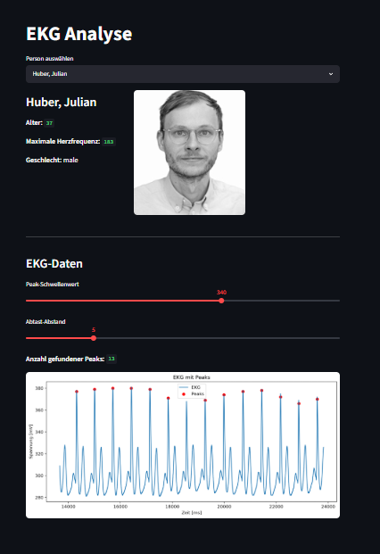

# EKG Analyse App

Diese Streamlit-App dient zur Anzeige und einfachen Analyse von EKG-Daten.
Es können Personen aus einer Datenbank ausgewählt werden. Danach werden persönliche Informationen wie Name, Alter, Geschlecht und maximale Herzfrequenz angezeigt. Zusätzlich wird das zugehörige EKG dargestellt und Peaks im Signal werden automatisch markiert.

Erstellt von **Laurence Bichlbauer** und **Jan Arnsteiner**.

## Projekt starten

Das Projekt wird mit **PDM** verwaltet.

Zuerst müssen alle notwendigen Abhängigkeiten installiert werden:

```bash
pdm install
```

Danach kann die Streamlit-App gestartet werden:

```bash
pdm run streamlit run main.py
```

## Notwendige Dateien

Damit die App funktioniert, müssen folgende Dateien und Ordner vorhanden sein:

```text
project/
│
├── main.py
├── pyproject.toml
├── pdm.lock
├── README.md
├── screenshot.png
│
├── data/
│   ├── person_db.json
│   └── weitere EKG-Dateien
│
└── src/
    ├── person.py
    ├── ekg_data.py
    └── read_data.py
```

Die Datei `person_db.json` enthält die Personendaten und Verweise auf die jeweiligen EKG-Dateien.
Die Python-Dateien im Ordner `src/` enthalten die Klassen und Funktionen zum Laden, Verarbeiten und Anzeigen der Daten.

## Screenshot


